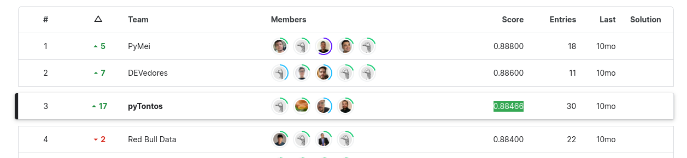
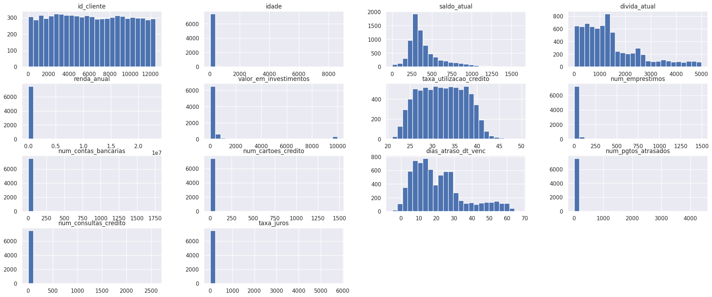
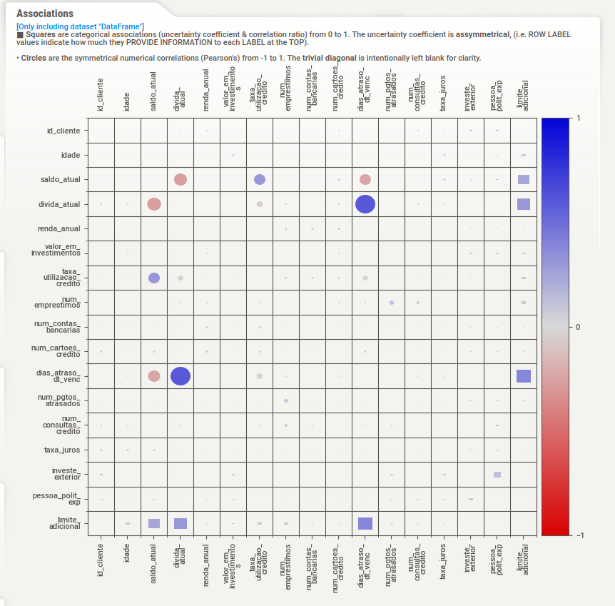
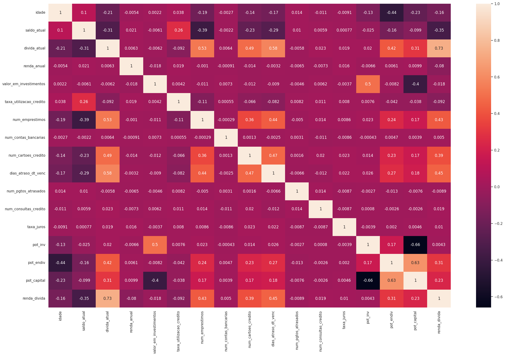
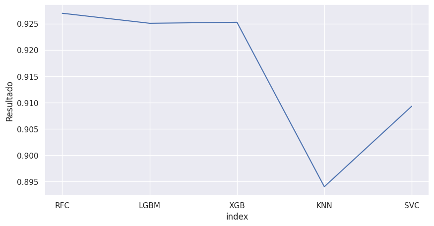

<h1 align="center"> "Billion Bank Credit Analysis" </h1>

# Welcome to my portfolio project for the Community DS data competition: "Billion Bank"

## 1.0 Business Context

Billion Bank is a Brazilian digital bank, founded in 2021. It currently offers digital accounts and credit cards.

When a customer requests a credit limit increase on their credit card, the bank consults a third-party credit company, which provides a recommendation: "deny" or "grant". This response is then conveyed to the customer.

Given that the credit company needs to gather more financial history information about the customer from third parties, the recommendation's return to the bank takes up to 5 business days!

As a service, with each credit limit increase request made by a customer, the bank incurs an additional consultation cost. To reduce this cost, in 2022, the bank decided to only accept new credit limit increase requests every 3 months.

The bank observed a slight increase in churn in the first semester, which escalated further in the second semester, becoming a concerning issue. The customer service team contacted former clients and found that the main reason for churn was the perception of bureaucracy related to limit increases.

To reverse this situation, the bank formulated an action plan with two objectives:
1 - Streamline the process, allowing customers to request a new limit once a week, with an instant response.
2 - Deactivate the time-consuming and costly third-party recommendation consultations for limit increases.

To implement this plan, the data science team was tasked with developing an in-house credit card limit increase evaluation model based on the historical recommendations ("deny" or "grant") from the credit company, combined with customer financial history.

The classification model should indicate whether Billion Bank should "deny" or "grant" the requested credit limit increase to the customer.

**Source:** [ Kaggle ](https://www.kaggle.com/competitions/cdshackdays3)

## 2.0 Preliminary Planning

- In this competition, the students of the Community DS were divided into squads, each consisting of 4 students. In total, we had 24 squads and over 90 participants.
- My squad had the following composition:

### The CRISP-DS method was used as the basis for developing this project

### 2.1 Tools, IDEs, and Libraries

- Python 3.09
- Visual Studio Code
- Jupyter Notebook
- Deepnote
- Libraries: Seaborn, Pandas, Numpy, Scipy, XGBoost, SKLearn, Category Encoders, K-Nearest Neighbor and LightGBM.

### 2.2 Final Product

* The final product will be the recommendation provided by the data science team. Values of "deny" or "grant" will be assigned based on the analysis and application of Machine Learning models. Therefore, the final result will be presented accurately and swiftly, streamlining the entire credit analysis process for the bank.

## 3.0 Data

##### This data is public and was downloaded from the [Kaggle](https://www.kaggle.com/competitions/cdshackdays3) webpage.

### 3.1 Source Attributes

| **Attributes**                  |  **Type**  |  **Description**                                                          |
| ------------------------------- | ---------- | ------------------------------------------------------------------------- |
| id_cliente                      |   int64    | Unique customer identifier                                                |
| idade                           |   int64    | Customer's age                                                            |
| saldo_atual                     | float64    | Current account balance of the customer                                    |
| divida_atual                    | float64    | Current debt amount of the customer                                       |
| renda_anual                     | float64    | Customer's annual income                                                  |
| valor_em_investimentos          | float64    | Total investment value                                                    |
| taxa_utilizacao_credito         | float64    | Credit card utilization rate                                              |
| num_emprestimos                 |   int64    | Number of loans taken by the customer                                     | 
| num_contas_bancarias            |   int64    | Number of bank accounts held by the customer                              |
| num_cartoes_credito             |   int64    | Number of credit cards owned by the customer                              |
| dias_atraso_dt_venc             |   int64    | Number of days overdue on credit card payments                            |
| num_pgtos_atrasados             |   int64    | Number of missed installment payments                                     |
| num_consultas_credito           |   int64    | Number of credit inquiries                                                |
| taxa_juros                      |   int64    | Interest rate value                                                       |
| investe_exterior                |  object    | Whether the customer has investments abroad                               |
| pessoa_polit_exp                |  object    | Whether the customer is a politically exposed person                      |
| limite_adicional                |  object    | Whether the customer will obtain additional credit limit (target variable) |    

### Created Attributes

Investment Potential -> calculated by dividing the investment value by the customer's age. 
Default Potential -> calculated by dividing the current debt by the customer's age. 
Available Investment Potential -> calculated by subtracting the Default Potential from the Investment Potential. 
Indebtedness -> the result of dividing the current debt by the current income.

## Visualization of numerical attributes in a bar plot

## Visualization of attribute correlations.

## Correlation heatmap of attributes using the "Pearson" method.

## 4.0 Data Modeling

In this stage, the data was prepared for the commencement of applying Machine Learning models. 
Categorical attributes were transformed using Label Encoder. 
Outliers in the columns age, num_cartoes_credito, and num_emprestimos were replaced with the median value. 
The columns id_cliente and pessoa_polit_exp were excluded as they were causing noise in the ML algorithm results.

## 5.0 Machine Learning Modeling

In the process of choosing Machine Learning models, tests and training were conducted with six types of classifiers: Random Forest Classifier, LGBM Classifier, XGBoost Classifier, K-Nearest Neighbors, and C-Support Vector Classification Model. 
The metric used for evaluating classification algorithms was the F1 Score.

## Performance

## 6.0 Ensemble Learning

Here, we applied the Ensemble Learning technique using the 'Voting Classifier' from the 'Scikit Learn' library. 
This algorithm combines the concepts of different Machine Learning classifiers and uses the majority vote or the average of predicted probabilities to make predictions for the target class. This classification can be used to achieve performance symmetry in the overall data balance. In other words, the algorithm leverages the strengths of a particular Machine Learning algorithm to balance out its weaknesses in classification.

## Final Performance of:

# 0.928834

## 7.0 Conclusion

After 32 hours of intensive hacking during the Hack Days event, the submission phase concluded, and the Leaderboard was sealed. Our team's effort culminated in a final accuracy score of 0.88466 in the Private classification - the most crucial metric in this kind of competition.

Securing the 3rd position in the overall leaderboard solidified our belief that we were steering our project in the right direction. The final rankings were determined down to the hundredths, underscoring the intense competition in the final stretch, with teams being evenly matched and unwaveringly dedicated to delivering a high-quality end result.

The pyTontos dos Dados team takes immense pride in delivering an exceptional project within a tight timeframe, warranting celebrations all around. The learning amassed in this brief period has been truly monumental!

I extend my heartfelt gratitude to my incredible teammates - Raquel, Eduardo, and Fernando. A special thank you also goes out to our mentors and the entire DS Community for their unwavering support and guidance throughout this journey!

## Leaderboard

